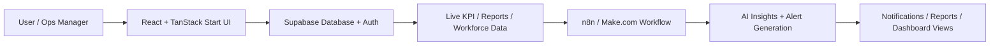

# 🚀 Smart Reporter AI

[](https://react.dev/)
[](https://www.typescriptlang.org/)
[](https://supabase.com/)
[](https://tanstack.com/start)

A polished AI-powered operations and workforce intelligence portfolio project for modern customer support teams.


---

## 1) 🌟 Project Title
Smart Reporter AI — AI Operations Dashboard & Workforce Intelligence Platform

## 2) 🧭 Product Overview
Smart Reporter AI is a modern SaaS-style dashboard designed to help operations teams monitor KPIs, detect anomalies, generate executive-ready reports, and surface AI-driven insights from live support data.

It combines:
- a premium React dashboard UI,
- Supabase-backed data access,
- workflow automation via n8n / Make.com,
- AI-style insight generation for staffing and operational trends.

## 3) 🎯 Problem Solved
Support and operations teams often struggle with:
- fragmented KPI visibility,
- manual report generation,
- delayed anomaly detection,
- poor workforce utilization tracking.

Smart Reporter AI solves this by centralizing operations data into a single interface and turning raw metrics into actionable insights.

## 4) 🏗️ Solution Architecture



### Architecture Summary
- Frontend: React, TypeScript, Tailwind, Radix UI
- Backend/Data: Supabase PostgreSQL + Auth
- Automation: n8n / Make.com webhook integrations
- Insight Layer: operational analytics + AI-generated summaries

## 5) ✨ Features
- Live KPI monitoring dashboard
- Workforce availability and performance overview
- AI-powered insight cards and anomaly detection
- Executive report generation
- Notification center for alerts and warnings
- Settings and integrations panel
- Responsive, modern SaaS-style UI

## 6) 🔄 Workflow Explanation
1. The user opens the dashboard.
2. Live KPI and workforce data are fetched from Supabase.
3. The app surfaces trends, alerts, and report summaries.
4. Webhooks and automation workflows enrich the reporting pipeline.
5. AI-generated insights are displayed to help teams act faster.

## 7) 🛠️ Tech Stack
- Frontend: React 19, TypeScript, Vite, TanStack Router / Start
- Styling: Tailwind CSS, shadcn/ui, Radix UI
- Data: Supabase
- Automation: n8n / Make.com
- Analytics: Recharts
- Tooling: ESLint, Prettier, Bun / npm

## 8) ⚙️ Installation Steps

### Prerequisites
- Node.js 18+
- Bun or npm
- Supabase project

### Setup
```bash
git clone <your-repo-url>
cd Smart\ Reporter\ AI\ portfolio
cd Frontend
bun install
```

### Run locally
```bash
bun run dev
```

The app will start on the local Vite dev server.

## 9) 🔐 Environment Variables
Create your environment file in the Frontend folder:

```env
SUPABASE_URL=https://your-project.supabase.co
SUPABASE_PUBLISHABLE_KEY=YOUR_SUPABASE_PUBLISHABLE_KEY
SUPABASE_PROJECT_ID=your-project-id

VITE_SUPABASE_URL=https://your-project.supabase.co
VITE_SUPABASE_PUBLISHABLE_KEY=YOUR_SUPABASE_PUBLISHABLE_KEY
VITE_SUPABASE_PROJECT_ID=your-project-id
```

> Never commit real secrets. Use placeholders and store production credentials in your hosting platform.

## 10) 📸 Screenshots

### Dashboard View


### Login View


### Notifications


### Workforce View


### Workflow Preview


## 11) 🎬 GIF Demos
Demo GIFs can be added here for a richer portfolio presentation:

- Demo 1: Dashboard walkthrough
- Demo 2: AI insights + report generation
- Demo 3: Notification / alert flow

Suggested placement:
```text
Screenshots/demo-dashboard.gif
Screenshots/demo-insights.gif
Screenshots/demo-workflow.gif
```

## 12) 🚀 Deployment Links
Preview / deployment links can be updated here once hosted:

- Live Demo: https://your-live-demo.vercel.app
- Frontend Repo: https://github.com/your-username/smart-reporter-ai
- Backend / Workflow: https://your-n8n-instance.n8n.cloud

## 13) 🗺️ Future Roadmap
- Add real AI summarization with LLM APIs
- Introduce role-based analytics and teams
- Add automated email / Slack notifications
- Expand to multi-tenant SaaS deployment
- Add advanced forecasting and anomaly scoring

## 14) 👤 Creator Information
Created by: Karan Walia  
Project type: AI SaaS portfolio / operations intelligence demo  
Focus: practical AI + analytics + workflow automation

## 15) 📄 License
This project is licensed under the MIT License.

---

If you want, I can next tailor this README for GitHub, LinkedIn portfolio use, or a live deployment page.
